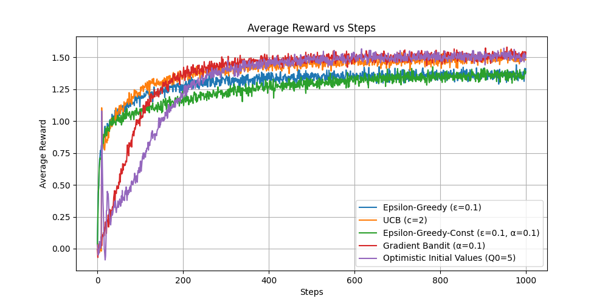
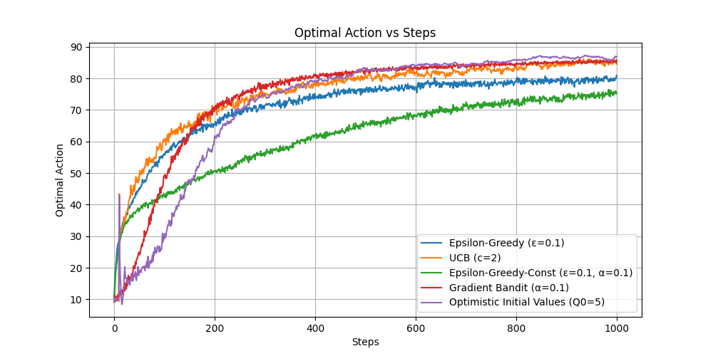

# k-bandit Problem Experiment

This directory contains the implementation and results for a k-armed bandit experiment.

## Description

The experiment compares several action-selection strategies applied to a simulated multi-armed bandit problem:

- **Epsilon-Greedy (sample average)**
- **Epsilon-Greedy with constant step size**
- **Upper Confidence Bound (UCB)**
- **Gradient Bandit**
- **Optimistic Initial Values**

Each agent interacts with a bandit whose true reward values are drawn from a standard normal distribution. Agents are evaluated over many independent runs, and two metrics are tracked across time steps:

1. Average reward obtained
2. Percentage of times the optimal action is selected

The script `train.py` defines the bandit environment, the agent classes, and the `run_experiment` helper that executes the simulation and aggregates results.

## Results

The following plots summarize the outcomes for the optimistic initial-values strategy (and can be extended to include other methods by uncommenting lines in the script and re-running the experiment):

### Average Reward vs Steps



### Optimal Action Percentage vs Steps



These graphics illustrate how the agent's performance evolves over the course of the simulation. The average reward plot shows the long-term return, while the optimal action plot indicates how quickly the agent converges to the best arm.

## Usage

Run the training file from the `k_bandit_problem` directory:

```bash
python3 train.py
```
