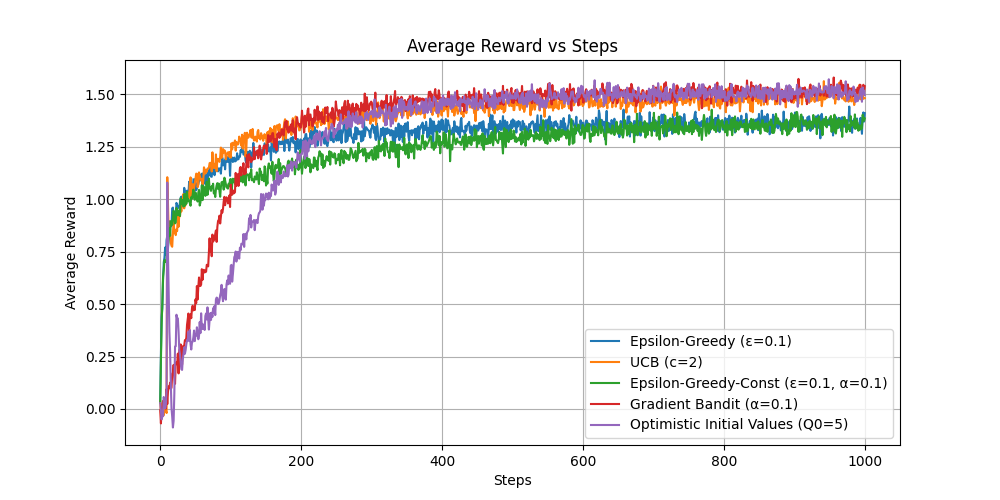
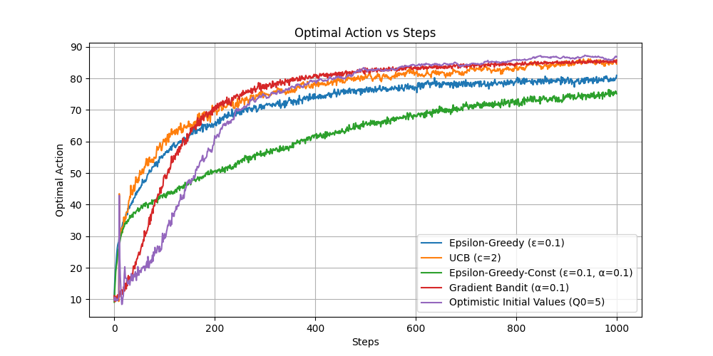

# k-Armed Bandit — Exploration Strategies

The bandit problem is one of the cleanest ways to study the exploration-exploitation tradeoff: you have k arms, each with an unknown reward distribution, and your goal is to figure out which is best without wasting too many pulls on bad ones. There's no state, no transitions — just the core tension between gathering information and acting on what you already know.

I implemented five strategies to see how they actually compare:

- **Epsilon-greedy (sample average)** — exploit the best known arm most of the time, explore randomly with probability ε; estimates are simple averages
- **Epsilon-greedy (constant step size)** — same idea, but weights recent rewards more heavily, which matters when the environment drifts
- **UCB** — instead of random exploration, pick the arm with the highest upper confidence bound; uncertainty itself drives exploration
- **Gradient bandit** — learns a preference over arms and updates via softmax policy gradient; no explicit value estimates
- **Optimistic initial values** — start with inflated estimates so every arm gets tried before the agent settles into exploitation

Each agent runs against a 10-armed bandit where true reward values are drawn from N(0,1), averaged across many independent runs.

## Results

### Average Reward vs Steps



### Optimal Action % vs Steps



```bash
python3 train.py
```
